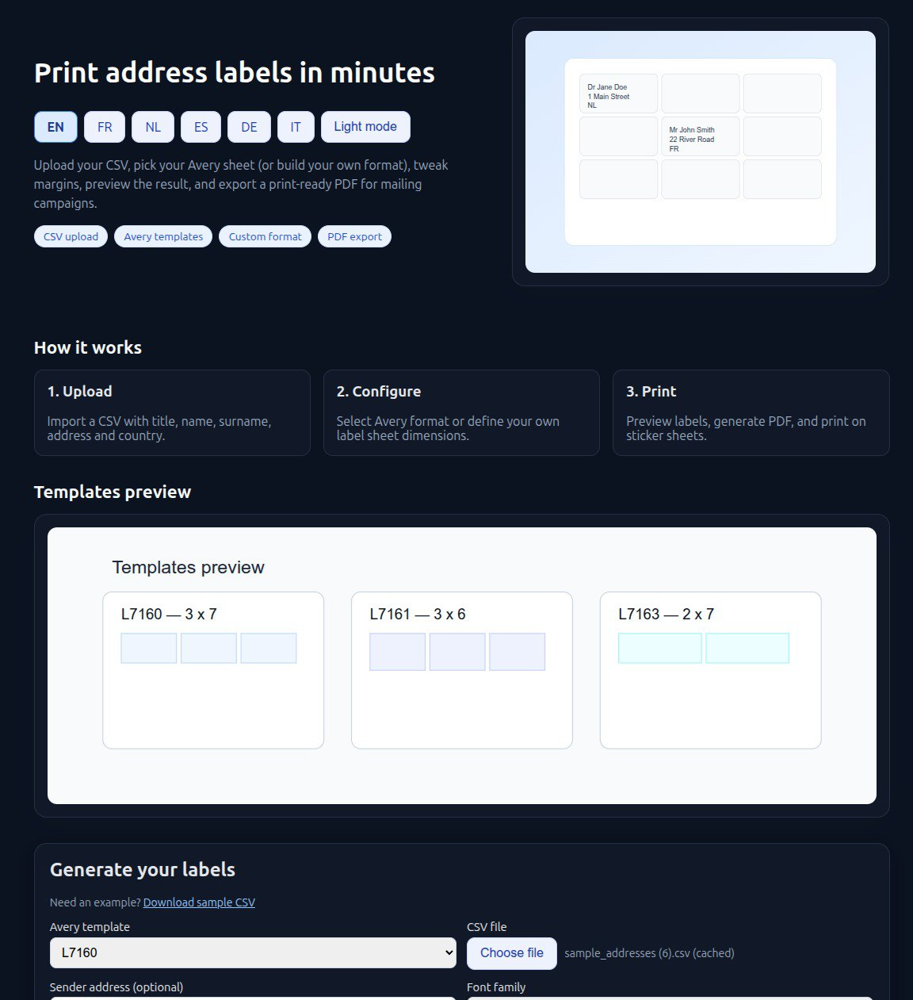
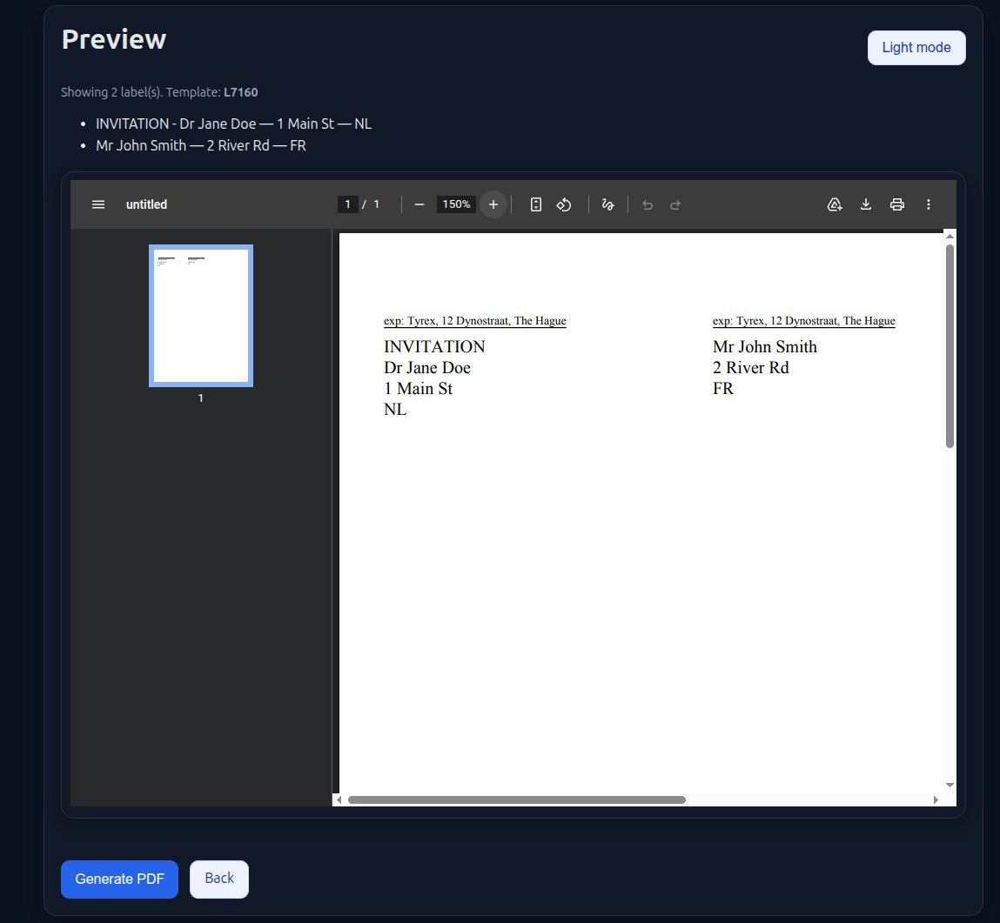

# Sticker Address Printer

A web app to generate printable PDF address labels from CSV for Avery sticker sheets (and custom formats).

## Live demo
🌐 https://sticker-address-printer.onrender.com/

## Screenshots

### Homepage


### Preview with inline PDF


## Features
- Upload CSV (with per-address `title_line_1` support)
- Avery templates + custom label format
- Margin tuning (top/right/bottom/left)
- Sender address block on each label (small + underlined)
- Font selection (Helvetica / Times / Courier)
- Inline PDF preview before download
- Multi-language UI (EN, FR, NL, ES, DE, IT)
- Dark mode + mobile-friendly UI
- Optional GA4 analytics with GDPR consent banner

## CSV columns
Required:
- `name`
- `surname`
- `address`
- `country`

Optional:
- `title`
- `title_line_1`

## Run locally
```bash
python3 -m venv .venv
source .venv/bin/activate
pip install -r requirements-dev.txt
python -m sticker_printer.web
```
Then open http://127.0.0.1:5000

## Tests (TDD)
```bash
source .venv/bin/activate
pytest -q
```

## Deployment (Render)
This project includes `render.yaml` and `Procfile`.

1. Push to GitHub
2. Create a Render Web Service from the repo
3. Use free plan
4. Deploy

## Traffic analytics (optional)
Set environment variable `GA_MEASUREMENT_ID` (example: `G-XXXXXXXXXX`).

### GDPR-friendly analytics consent
When `GA_MEASUREMENT_ID` is set, a cookie-consent banner is shown:
- **Accept**: loads Google Analytics (gtag)
- **Reject**: GA is not loaded

Consent choice is stored in localStorage key `cookie_consent_v1`.
